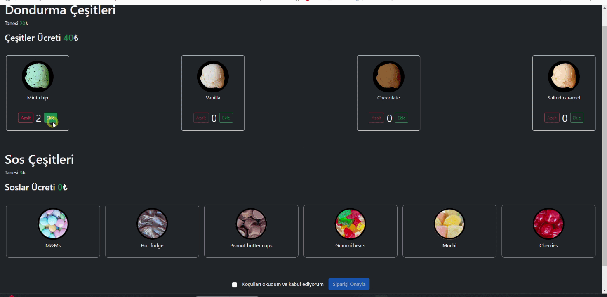

# Unit Test İCE Cream App

# Kütüphaneler

- json-server
- bootstrap
- axios@^0.27.2
- @testing-library/user-event@14.0

# Selector - Seçiciler

- Test içerisnde JSX elementlerini çağırmaya yarayan methodlardır
- screen nesnesi aracılığı ile kullanılır
- https://testing-library.com/docs/queries/about/

# HTML Element Rolleri

- her html elementinin kendini temsil eden bir rolü vardır. Bu rol ismi bazen etiket ismi ile aynı (button 'ın rolü button) bazen de farklı(h1 'in rolü heading) olabilir.

- https://developer.mozilla.org/en-US/docs/Web/Accessibility/ARIA/Roles

# Matchers - Kontrolcüler

- expect komutu ile birlikte kullanılan ve bir element veya değişken üzerindeki beklenetimizi kontrol edene methodlardır.
- örn: (rengi kırmızıdır | checkbox tiklidir | buton aktiftir | yazı içeriği şudur | dizinin uzunluğu 5 tir)

- Değişkenler için kullanılan matcher'lar:
- - https://jestjs.io/docs/using-matchers

- HTML elementi için kullanılan matcher'lar:
- - https://github.com/testing-library/jest-dom

# Test Geliştirme Süreci

## TDD (Test Driven Development)

- Önce testler yazılır sonra işlevler/bileşenler kodlanır
- red to green
- Artısı, testler bir yük olarka gelmez.Test yazmak, geliştirme sürecinin bir parçası oluyor. Testleri yazarken dinamik yapının bir algoritmasını oluşturduğumuz için işlevi daha hızlı kodlayabiliyoruz

## BDD (Behaviour Driven Development)

- Önce işlev/bileşen kodlanır sonra testleri yazılır.

# FireEvent

- rtl içerisinde gelen olay tetiklemek için kullandığımız method.
- gerçek kullanıcıdan uzak tepkiler verdiği için yerini UserEvent'e bıraktı.
- Tetiklenen olaylar gerçek bir insanın tepkisinden çok daha hızlı bir şekilde aniden gerçekleştiği için testlerde tutarsızlıklara ve beklenmedik sonuçlara sebep olabiliyor

# UserEvent

- fireEvent'in modern / gelişmiş versiyonu
- tetiklediğimiz olaylar fireEvent gibi doğrudab tetiklenmesis yeribe gerçek bir kullanıcıyı simüle ederek belirli bir gecikmenin ardından tetiklenir
- kullanılması için userEvent kütüphanesi kurulmalıdır
- async çalıştığı için async await ile kullanılır

# Mock

- Unit testlerde "mock" kullanımı, bir fonksiyonun veya nesnenin belirli bir kısmını izole ederek test etmeye yarar. Özellikle dış bağımlılıkları olan fonksiyonları test etmek için kullanılır. Bu sayede gerçek sistem bileşenlerine bağımlı olmadan sadece test edilmek istene kodun doğru çalışıp çalışmadığı kontrol edilir.

- Dışa Bapımlılıkları izole ederiz

- Fonksiyonlar çağrıldı mı kontrolü ypamamızı sağlar

- Fonksiyonlara gönderilen parametreleri kontrol edebilir

# 100% Test Covarage

# Localhost db.json 4060 açılmalıdır

# Ekran görüntüsü

# 
# Unit-Test-ce-Cream-App
